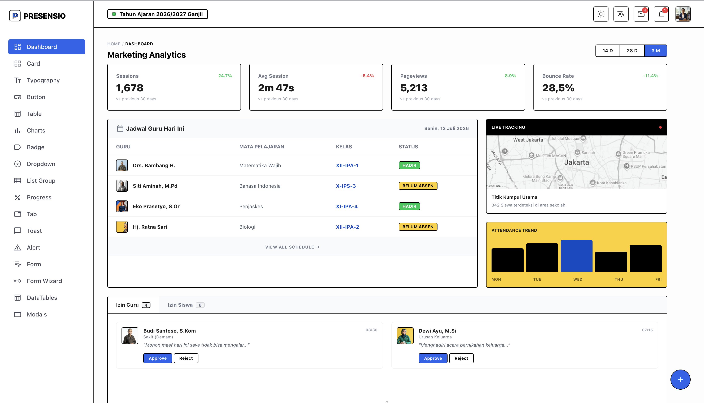

<div align="center">
  <p>
    <a href="README.md">🇬🇧 English</a> &nbsp;&bull;&nbsp;
    🇮🇩 Indonesia
  </p>
  
  <h1>Presensio templates by TechisMology</h1>
  <p><em>Template UI gratis bertema neobrutalism yang modern, ditenagai oleh ViteJS dan Tailwind CSS v4.</em></p>
</div>



## 🎨 Tentang Presensio templates

**Presensio templates** adalah template proyek *open-source* gratis yang didesain dengan estetika **Neobrutalism** yang mencolok. Dibuat oleh **TechisMology**, template UI gratis ini menggabungkan kecepatan ViteJS dengan kekuatan utilitas dari Tailwind CSS v4, sangat cocok untuk membangun aplikasi web modern dengan cepat.

Yang membuat Presensio templates unik adalah pendekatannya terhadap komponen UI. Template ini mengadaptasi struktur komponen ramah developer seperti **Bootstrap** (contoh: *cards, modals, buttons, alerts, forms*) namun dibangun sepenuhnya menggunakan CSS dan Tailwind CSS v4 yang telah dikustomisasi secara khusus. Ini memberikan Anda keuntungan ganda: kemudahan penggunaan komponen bergaya Bootstrap dipadukan dengan desain modern, performa tinggi, dan fleksibilitas dari template Tailwind v4.

## 🚀 Fitur Utama

- **Desain Neobrutalism:** Warna-warna berani, bayangan tajam, dan garis tepi kontras tinggi untuk tampilan yang mencolok.
- **ViteJS:** Server pengembangan yang secepat kilat dan optimasi build produksi.
- **Tailwind CSS v4:** Ditenagai oleh versi terbaru dari *framework* CSS *utility-first* paling populer.
- **Komponen ala Bootstrap:** Komponen UI bawaan yang dapat dikustomisasi (*Buttons, Modals, Cards, Alerts*, dll.) menggunakan lapisan CSS khusus (lihat direktori `src/assets/*.css`).
- **Gratis & Open Source:** Template UI yang sepenuhnya gratis untuk memulai proyek web Anda berikutnya.

## 📦 Panduan Memulai

Ikuti langkah-langkah berikut untuk menjalankan proyek ini di mesin lokal Anda.

### Persyaratan Awal

Pastikan Anda telah menginstal [Node.js](https://nodejs.org/).

### 1. Instalasi

Masuk ke direktori proyek dan instal dependensi yang dibutuhkan:

```bash
# Menginstal dependensi
npm install
```

### 2. Tahap Pengembangan

Jalankan server pengembangan ViteJS:

```bash
npm run dev
```

Aplikasi dapat diakses melalui `http://localhost:5173` (atau port yang tertera di terminal Anda).

### 3. Build Produksi

Untuk membuat *build* produksi yang telah dioptimasi, jalankan:

```bash
npm run build
```

File hasil *build* akan dihasilkan di folder `dist`, dan siap untuk di-*deploy*.

## 🧱 Sistem Komponen

Presensio templates menggunakan struktur komponen yang sangat terinspirasi dari Bootstrap. Di dalam direktori `src/assets/`, Anda akan menemukan file CSS khusus untuk setiap jenis komponen (misalnya, `button.css`, `modal.css`, `card.css`, `alert.css`).

File-file ini berisi gaya neobrutalisme khusus yang terintegrasi sempurna dengan Tailwind CSS v4. Anda bisa menggunakan *class* bawaan ini di HTML Anda untuk membuat antarmuka dengan cepat, mempertahankan alur kerja yang konsisten layaknya menggunakan Bootstrap, namun dengan bahasa desain yang jauh berbeda.

---

**Crafted with 🖤 by TechisMology**
